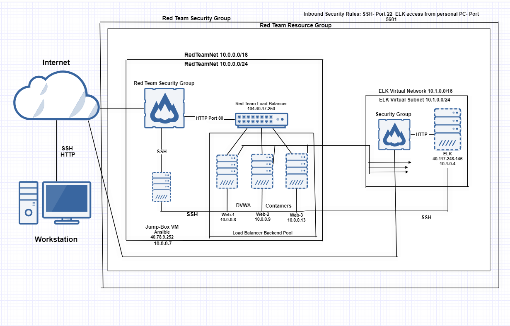

## Automated ELK Stack Deployment
The files in this repository were used to configure the network depicted below.

These files have been tested and used to generate a live ELK deployment on Azure. They can be used to either recreate the entire deployment pictured above. Alternatively, select portions of the _YAML__ file may be used to install only certain pieces of it, such as Filebeat.

  - _TODO: Enter the playbook file._
 

This document contains the following details:
- Description of the Topology
- Access Policies
- ELK Configuration
  - Beats in Use
  - Machines Being Monitored
- How to Use the Ansible Build

### Description of the Topology
The main purpose of this network is to expose a load-balanced and monitored instance of DVWA, the D*mn Vulnerable Web Application.
Load balancing ensures that the application will be highly available, in addition to restricting _access____ to the network.

- _TODO: What aspect of security do load balancers protect? What is the advantage of a jump box?
Load balancers protect the system from DDoS attacks by shifting traffic and prevents server overloads. The advantage of a jump box is by being the only gateway for access to your network, reducing the size of any potential attack. 
Integrating an ELK server allows users to easily monitor the vulnerable VMs for changes to the log files_and system _resources.

- _TODO: What does Filebeat watch for?
_
Filebeat logs information about the file system, colleges log files from a variety of databases, collects data about specific files on remote machines installed on VM under monitoring and watches for files that have changed and when they changed, then forwards them to Elasticsearch. 

- _TODO: What does Metricbeat record?_

Metricbeat collects and records metrics from the operating system/target server and services running on the server and sends the results to Elasticsearch. 

The configuration details of each machine may be found below.
_Note: Use the [Markdown Table Generator](http://www.tablesgenerator.com/markdown_tables) to add/remove values from the table_.

| Name     | Function | IP Address | Operating System |
|----------|----------|------------|------------------|
| Jump Box | Gateway  | 10.0.0.7   | Linux            |
| Web-1    | VM       | 10.0.0.8   | Linux            |
| Web-2    | VM       | 10.0.0.9   | Linux            |
| Web-3    | VM       | 10.0.0.13  | Linux            |
| ELK-VM   | VM       | 10.1.0.4   | Linux    	   |

### Access Policies
The machines on the internal network are not exposed to the public Internet. 
Only the _host/source_ machine can accept connections from the Internet. Access to this machine is only allowed from the following IP addresses:
- _TODO: Add whitelisted IP addresses_

- 10.0.0.7
- 10.0.0.8
- 10.0.0.9
- 10.0.0.13
- 10.1.0.4
- 75.70.87.43

Machines within the network can only be accessed by _SSH____.
- _TODO: Which machine did you allow to access your ELK VM? What was its IP address?_My Unbuntu VM was used to access my ELK VM and the IP address is 75.70.87.43.

A summary of the access policies in place can be found in the table below.
| Name     | Publicly Accessible | Allowed IP Addresses |
|----------|---------------------|----------------------|
| Jump Box | Yes/No              | 10.0.0.1 10.0.0.2    |
|          |                     |                      |
|          |                     |                      |

### Elk Configuration
Ansible was used to automate configuration of the ELK machine. No configuration was performed manually, which is advantageous because...

- _TODO: What is the main advantage of automating configuration with Ansible?

The main advantage of automating configuration with Ansible is that it provides a stable environment for DevOps to work with and helps testing run smoothly and aids in better representation with Infrastructure as Code.

The playbook implements the following tasks:
- _TODO: In 3-5 bullets, explain the steps of the ELK installation play. 

- Install Docker;
- Download image;???
- Attach container.
- SSH into ELK VM and add ELK VM to Ansible hosts file.
- Create and add playbook that installs docker and configures the container with a YAML file.
- Verify configurations in YAML file are correct and playbook.
- Verify access to Elk VM with SSH.
- Run docker ps to verify container is attached and running.

The following screenshot displays the result of running `docker ps` after successfully configuring the ELK instance. 

![TODO: Update the path with the name of your screenshot of docker ps output]  C:\Users\alexc\Pictures\Screenshots\ELK_docker_ps

### Target Machines & Beats
This ELK server is configured to monitor the following machines:
- _TODO: List the IP addresses of the machines you are monitoring_

	(webservers in host file)
	- 10.0.0.7 (Jump-Box)
	- 10.0.0.8 (Web-1)
	- 10.0.0.9 (Web-2)
	- 10.0.0.13 (Web-3)
	- 10.1.0.4 (ELK-VM)

We have installed the following Beats on these machines:
- _TODO: Specify which Beats you successfully installed_
- Filebeat
- Metricbeat

These Beats allow us to collect the following information from each machine:
- _TODO: In 1-2 sentences, explain what kind of data each beat collects, and provide 1 example of what you expect to see. E.g., `Winlogbeat` collects Windows logs, which we use to track user logon events, etc._

Filebeat allows us to collect log files such as audits or server logs from the host machine which then sends the content to Elasticsearch which then allows for easily readable outputs with Kibana. 

Metricbeat allows you to log and track the host machine’s metrics such as CPU usage, file systems and memory, which then can be used with Kibana for easy visualization of the output for further needs.    

### Using the Playbook
In order to use the playbook, you will need to have an Ansible control node already configured. Assuming you have such a control node provisioned: 
SSH into the control node and follow the steps below:

- Copy the _YAML file to _ansible/etc/hosts____.
- Update the _hosts_ file to include...
- Run the playbook, and navigate to ELK VM_ to check that the installation worked as expected.

_TODO: Answer the following questions to fill in the blanks:_

- _Which file is the playbook? Where do you copy it? YAML file; ansible/etc/hosts 

- _Which file do you update to make Ansible run the playbook on a specific machine? hosts 

How do I specify which machine to install the ELK server on versus which to install Filebeat on? 
To specify the machine to install the ELK server on, you nano into the etc/ansible/hosts file, nano into the install ELK Configuration file and add remote user’s name.

To specify for Filebeat, you nano into the etc/ansible/roles file, modify the filebeat-playbook to include all webservers in the container. 

- _Which URL do you navigate to in order to check that the ELK server is running? http://[your.ELK-VM.External.IP]:5601/app/kibana

_As a **Bonus**, provide the specific commands the user will need to run to download the playbook, update the files, etc._

  
 

